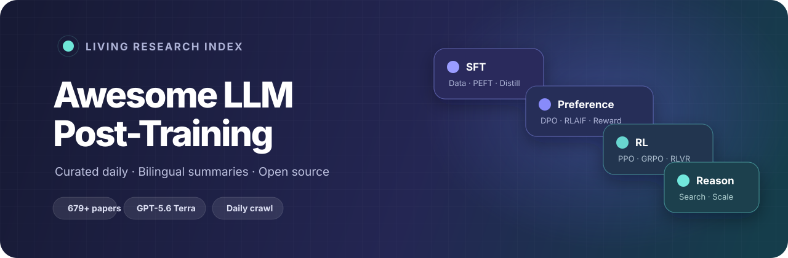
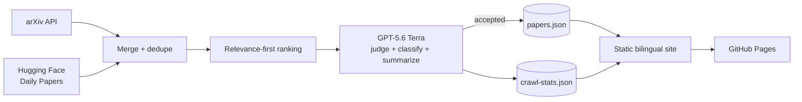

<p align="center">
  <a href="https://yang-ze-kang.github.io/awesome-llm-post-training/">
    
  </a>
</p>

<p align="center">
  <a href="https://yang-ze-kang.github.io/awesome-llm-post-training/"></a>
  <a href="data/papers.json"></a>
  <a href=".github/workflows/crawl.yml"></a>
  <a href=".github/workflows/crawl.yml"></a>
  <a href="LICENSE"></a>
</p>

<p align="center">
  A bilingual, auto-updating map of the LLM post-training literature.<br />
  从监督微调到推理强化学习：持续更新、中英双语的 LLM 后训练论文地图。
</p>

<p align="center">
  <a href="https://yang-ze-kang.github.io/awesome-llm-post-training/"><strong>Browse papers</strong></a>
  · <a href="https://yang-ze-kang.github.io/awesome-llm-post-training/#explore">Explore the taxonomy</a>
  · <a href="#crawl-observatory">Crawl observatory</a>
  · <a href="#contributing">Contribute</a>
</p>

---

## Why this project

LLM post-training moves quickly and its vocabulary is fragmented across SFT, RLHF, DPO, GRPO, RLVR, test-time scaling, reward modeling, and alignment. This project turns that stream into a navigable research index:

- **Curated, not merely scraped** — each candidate is judged for relevance and assigned to a stable taxonomy.
- **Bilingual by default** — every paper includes a concise English and Simplified Chinese summary.
- **Fresh every day** — a GitHub Action scans arXiv and Hugging Face Daily Papers, then publishes accepted work automatically.
- **Transparent operations** — the site exposes candidates, accepted-paper types, API tokens, and estimated cost for every measured crawl.
- **Zero-build static site** — plain HTML, CSS, and JavaScript; easy to fork and host on GitHub Pages.

## Research map

| Layer | Topics covered |
| --- | --- |
| **Supervised Fine-Tuning** | Instruction tuning · PEFT / LoRA · data synthesis · knowledge distillation |
| **Reinforcement Learning** | Reward modeling · RLHF / PPO / RLOO · DPO / IPO / KTO / SimPO · RLAIF · reasoning RL / GRPO / RLVR |
| **Test-Time Scaling** | Chain-of-thought · inference-time compute · search / MCTS / tree methods |
| **Resources** | Surveys · benchmarks and datasets · safety and alignment · tools and frameworks |

The taxonomy lives in [`data/categories.json`](data/categories.json). Adding a category there automatically updates both the website navigation and the model’s classification choices.

## How it works



The crawler uses the OpenAI Responses API with structured JSON output. `gpt-5.6-terra` is the default model; `OPENAI_MODEL` can select another GPT-5.6 tier. The default `low` reasoning effort is a deliberate fit for short classification tasks and can be overridden.

## Crawl observatory

Click **Crawl stats / 爬取统计** on the website to inspect:

- candidates fetched from arXiv and Hugging Face, merged, and evaluated;
- papers accepted, rejected, errored, and added by research category;
- input, cached-input, cache-write, output, reasoning, and total tokens;
- API calls, run duration, selected model, and estimated USD cost;
- daily line charts for tokens, cost, added papers, and category-level additions;
- a per-run history table, including successful, empty, dry-run, and failed crawls.

Statistics start with the first run of this version; the project intentionally does not invent historical token usage. Cost is estimated from the usage returned by the API and the standard rates stored with each run. For the default model, see the official [GPT-5.6 Terra model and pricing documentation](https://developers.openai.com/api/docs/models/gpt-5.6-terra).

The append-only history is stored in [`data/crawl-stats.json`](data/crawl-stats.json), so it remains auditable and deploys with the static site.

## Quick start

The site fetches local JSON files, so serve it over HTTP:

```bash
git clone https://github.com/yang-ze-kang/awesome-llm-post-training.git
cd awesome-llm-post-training
python3 -m http.server 8000
```

Open <http://localhost:8000>. No package installation or build step is required.

### Run the crawler locally

```bash
export OPENAI_API_KEY="your-api-key"
# Optional overrides:
export OPENAI_MODEL="gpt-5.6-terra"
export OPENAI_REASONING_EFFORT="low"
export OPENAI_BASE_URL="https://api.openai.com/v1"

python3 scripts/crawl.py
```

Without `OPENAI_API_KEY`, the command performs a read-only dry run: it fetches, deduplicates, and ranks candidates without changing local data. Set `RECORD_CRAWL_STATS=1` if you explicitly want a local dry run added to the history.

| Variable | Default | Purpose |
| --- | --- | --- |
| `OPENAI_MODEL` | `gpt-5.6-terra` | Responses API model used for curation |
| `OPENAI_REASONING_EFFORT` | `low` | `none`, `low`, `medium`, `high`, `xhigh`, or `max` |
| `OPENAI_BASE_URL` | `https://api.openai.com/v1` | OpenAI-compatible Responses API base URL |
| `CRAWL_DAYS` | `3` | Source lookback window |
| `MAX_CANDIDATES` | `40` | Maximum candidates evaluated per run |
| `DISABLE_HF` | unset | Set to `1` to use arXiv only |

## Project structure

```text
.
├── index.html                    # static application shell + stats dialog
├── assets/
│   ├── app.js                    # search, navigation, rendering, crawl dashboard
│   ├── i18n.js                   # English / Chinese UI strings
│   ├── style.css                 # responsive light / dark design system
│   └── readme-hero.svg           # GitHub README banner
├── data/
│   ├── categories.json           # bilingual hierarchical taxonomy
│   ├── papers.json               # curated paper database
│   └── crawl-stats.json          # append-only run, token, and cost history
├── scripts/
│   └── crawl.py                  # sources → GPT-5.6 → data + statistics
└── .github/workflows/
    ├── crawl.yml                 # daily crawl and data commit
    └── pages.yml                 # GitHub Pages deployment
```

## Paper data model

```json
{
  "id": "2501.12948",
  "title": "DeepSeek-R1: Incentivizing Reasoning Capability in LLMs via RL",
  "category": "reasoning",
  "date": "2025-01-22",
  "venue": "arXiv",
  "url": "https://arxiv.org/abs/2501.12948",
  "summary": {
    "en": "...",
    "zh": "..."
  }
}
```

Category IDs must exist in [`data/categories.json`](data/categories.json). The UI sorts papers by date at render time, so source order is not significant.

## Deployment

Fork the repository, enable **Settings → Pages → GitHub Actions**, and add the `OPENAI_API_KEY` Actions secret. The included workflows take care of the rest. Full setup, optional variables, scheduling, and troubleshooting are documented in [`DEPLOY.md`](DEPLOY.md).

## Contributing

Contributions are welcome for:

- missing or newly released papers;
- taxonomy improvements;
- corrected summaries, metadata, or translations;
- crawler sources, ranking, tests, and UI accessibility.

You can edit JSON directly or open an issue with a paper link and suggested category. Please keep summaries factual and concise.

## Acknowledgements

Seeded from [mbzuai-oryx/Awesome-LLM-Post-training](https://github.com/mbzuai-oryx/Awesome-LLM-Post-training) and extended with an automated, bilingual curation and observability pipeline.

## License

[MIT](LICENSE)
